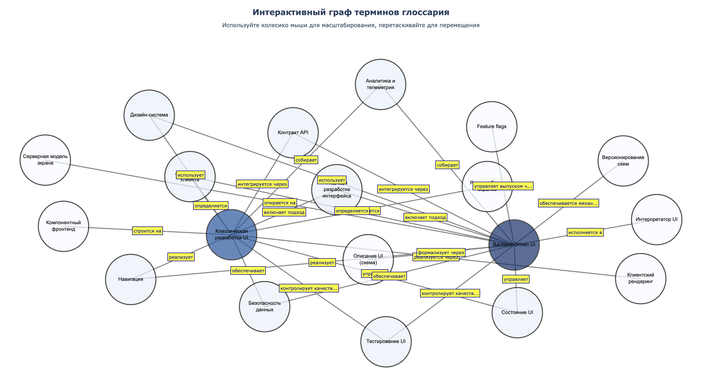

# python-itmo-glossary-rpc

Деплой тут https://yuliya-karimova.github.io/python-itmo-glossary-rpc/  
Отчет - [REPORT.md](REPORT.md)



Проект реализует gRPC-сервис для работы с графом терминов глоссария с использованием Protocol Buffers.

## Создание виртуального окружения

Рекомендуется использовать виртуальное окружение для изоляции зависимостей проекта.

### Создание виртуального окружения

Создайте виртуальное окружение:

```bash
python3 -m venv venv
```

Или с использованием `virtualenv`:

```bash
virtualenv venv
```

### Активация виртуального окружения

**На macOS/Linux:**
```bash
source venv/bin/activate
```

**На Windows:**
```bash
venv\Scripts\activate
```

После активации в начале строки терминала появится `(venv)`.

### Деактивация виртуального окружения

Для выхода из виртуального окружения выполните:

```bash
deactivate
```

## Установка зависимостей

После активации виртуального окружения установите необходимые пакеты:

```bash
pip install grpcio grpcio-tools
```

Или используйте файл requirements.txt:

```bash
pip install -r requirements.txt
```

## Генерация файлов из .proto

Для генерации Python классов из protobuf-файлов выполните:

```bash
python -m grpc_tools.protoc -I./protobufs --python_out=. --pyi_out=. --grpc_python_out=. ./protobufs/glossary.proto
```

Эта команда создаст файлы:
- `glossary_pb2.py` - классы для сообщений protobuf
- `glossary_pb2.pyi` - типы для статической проверки
- `glossary_pb2_grpc.py` - классы для gRPC сервиса и клиента

## Запуск сервера

Запустите gRPC сервер в одном терминале:

```bash
python3 glossary_server.py
```

Сервер будет запущен на порту **50052** и выведет информацию о загруженных данных:

```
Загружено терминов: 19
Загружено связей: 26
Glossary gRPC сервер запущен, слушает порт 50052
```

## Запуск клиента

В другом терминале запустите клиент для тестирования:

```bash
python3 glossary_client.py
```

Клиент автоматически выполнит несколько примеров использования API:
- Получение всех терминов
- Получение информации о конкретном термине
- Получение связей термина
- Поиск пути между терминами

## Визуализация графа

Есть два способа визуализации графа:

### Интерактивная визуализация (рекомендуется)

Создает HTML файл с возможностью **масштабирования, прокрутки и наведения мыши**:

```bash
python3 visualize_graph_interactive.py
```

Скрипт создаст файл `index.html`, который можно открыть в браузере.

**Возможности интерактивной визуализации:**
- 🖱️ **Масштабирование** - колесико мыши или жесты на тачпаде
- 🖱️ **Прокрутка/Перемещение** - перетаскивание мышью для навигации по графу
- 🖱️ **Подсказки** - наведите на узел, чтобы увидеть полное определение термина
- 📱 **Масштабирование под экран** - граф автоматически подстраивается под размер окна браузера
- 🏷️ **Названия связей** - метки типов отношений отображаются на связях

### Статическая визуализация (PNG)

Создает изображение PNG:

```bash
python3 visualize_graph.py
```

Скрипт создаст файл `glossary_graph.png` с визуализацией графа, где:
- **Узлы** (кружки) представляют термины
- **Связи** (стрелки) показывают отношения между терминами
- Размер узла пропорционален количеству связей
- Цвет узла темнее, если у него больше связей
- **Названия связей** отображаются на каждой стрелке

Скрипт также выводит статистику графа:
- Количество узлов и связей
- Наиболее связанные термины
- Компоненты связности

**Пример вывода:**
```
Загружено терминов: 19
Загружено связей: 26

============================================================
Статистика графа:
============================================================
Всего узлов (терминов): 19
Всего связей (ребер): 26
Средняя степень узла: 2.74

Топ-5 наиболее связанных терминов:
  - Backend-Driven UI: 14 связей
  - Классическая разработка UI: 14 связей
  ...
```

**Настройка визуализации:**

В файле `visualize_graph.py` можно изменить параметры:
- `layout` - тип раскладки графа ('spring', 'circular', 'kamada_kawai')
- `figsize` - размер изображения
- `output_file` - имя выходного файла

## Структура проекта

- `protobufs/glossary.proto` - определение gRPC сервиса и сообщений
- `glossary_server.py` - реализация gRPC сервера
- `glossary_client.py` - клиент для тестирования
- `visualize_graph.py` - скрипт для статической визуализации графа (PNG)
- `visualize_graph_interactive.py` - скрипт для интерактивной визуализации графа (HTML)
- `terms.csv` - файл с терминами (название, определение)
- `links.csv` - файл со связями между терминами
- `REPORT.md` - подробный отчет о проекте с примерами

## Как работает граф

Граф терминов представляет собой **ориентированный граф**, где:

1. **Узлы (nodes)** — это термины из файла `terms.csv`
   - Каждый узел содержит название термина и его определение

2. **Связи (edges)** — это отношения между терминами из файла `links.csv`
   - Каждая связь имеет направление (от источника к цели)
   - Связь имеет тип (например, "включает подход", "реализуется через")

3. **Структура данных:**
   ```
   "Подход к разработке интерфейса" → "Классическая разработка UI"
   "Подход к разработке интерфейса" → "Backend-Driven UI"
   "Backend-Driven UI" → "Серверная модель экрана"
   ```

4. **Операции с графом:**
   - Поиск термина по названию
   - Получение всех связанных терминов
   - Поиск пути между двумя терминами (алгоритм BFS)
   - Визуализация всей структуры графа

Граф хранится в памяти и загружается из CSV файлов при запуске сервера.

## API сервиса

Сервис предоставляет следующие методы:

- `GetTerm` - получить информацию о термине
- `GetAllTerms` - получить все термины
- `GetTermRelations` - получить связи термина
- `FindPath` - найти путь между двумя терминами

Подробное описание и примеры использования см. в файле `REPORT.md`.
